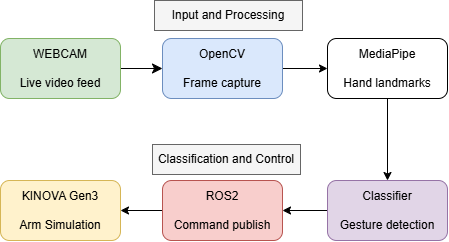

# Human Gesture-Based Robot Telemanipulation
Real-time hand gesture recognition (MediaPipe + OpenCV) for teleoperating a Kinova Gen3 arm in simulation using ROS2 and RelaxedIK.

## Demo

## Gesture Mapping

| Gesture | Action | Logic |
|---------|--------|-------|
| Open Palm | Open gripper / Move arm | Fingertips (index–pinky) above base knuckles; thumb tip to the right of wrist (left hand) |
| Fist | Close gripper / Move arm | Fingertips (index–pinky) below base knuckles; thumb tucked |
| Thumbs Up | Activate system | Fingers curled, thumb tip above wrist, handedness-aware X check |
| Thumbs Down | Pause system | Thumb tip below wrist, handedness-aware X check |

Arm movement runs continuously when the system is active, based on wrist landmark position. Gestures trigger gripper commands.

## System Architecture

## Dependencies
- Ubuntu 24.04
- ROS2 Jazzy
- [relaxed_ik_ros2](https://github.com/uwgraphics/relaxed_ik_ros2)
- [ros2_kortex](https://github.com/Kinovarobotics/ros2_kortex) (KINOVA Gen3 support)
- Gazebo Harmonic (`ros-jazzy-ros-gz`) *(planned for pick-and-place)*
- Python 3.12
- MediaPipe 0.10.13
- OpenCV 4.8.1
- NumPy < 2
- Rust (for RelaxedIK core compilation)

## Installation & Setup

## Usage

## Known Limitations

## Acknowledgements
